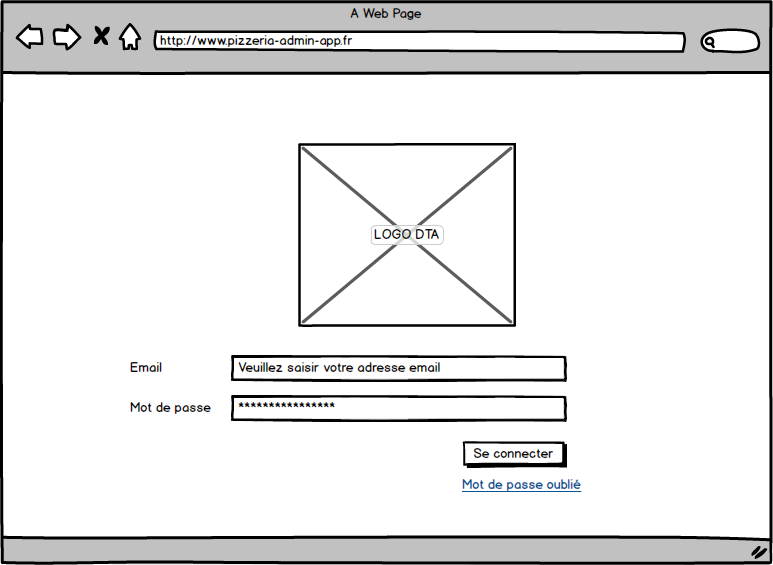

# USA001 - Authentification - Page Login
En tant qu'administrateur, je dois pouvoir m'authentifier afin d'accéder aux fonctionnalités du système.

Les informations d'authentification sont vérifiées dans une table (`user` par exemple).

Un utilisateur de l'application Admin possède les informations suivantes :

* Email
* Mot de passe
* Nom
* Prénom

Une fois connectée, l'utilisateur est redirigé vers la page d'administration des commandes.

Lorsque l'utilisateur clique sur le lien mot de passe oublié, un nouveau mot de passe est généré et est envoyé par email à l'utilisateur. Le système attend la confirmation de l'utilisateur (clic sur un lien envoyé) en l'invitant à saisir un nouveau mot de passe.

Un utilisateur non connecté, n'a accès à aucune fonctionnalité.

