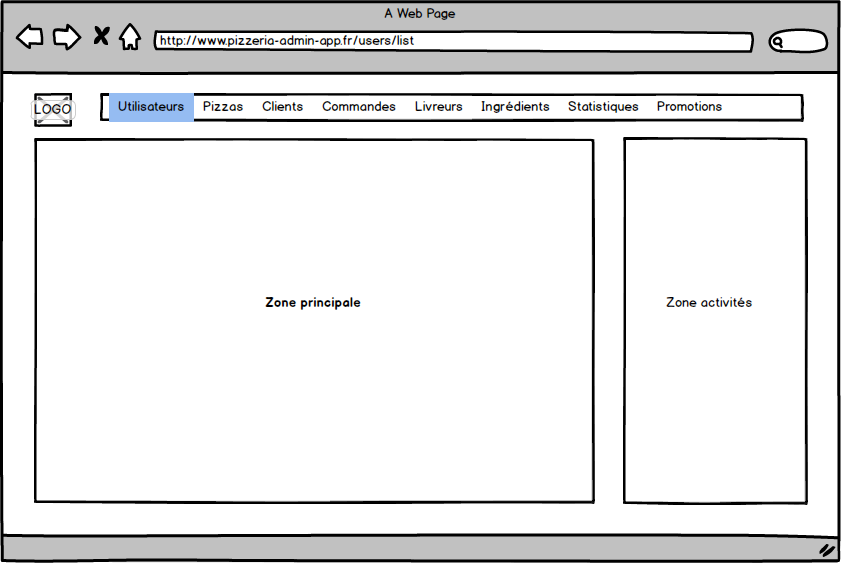

# USA002 - Menu

En tant qu'administrateur, je souhaite avoir accès à une barre de menu sur toutes les pages permettant d'aller sur les listes des différentes rubriques (utilisateur, pizza, client,...).

L'objectif est de mettre en place la structure générale du site.

Les liens disponibles :

* Utilisateurs
* Pizzas
* Menus
* Desserts
* Boissons
* Clients
* Commandes
* Livreurs
* Ingrédients
* Statistiques
* Promotions

Les liens sont désactivés tant que la fonctionnalité associée n'est pas développée.

La zone activités reste grisée pour le moment.

