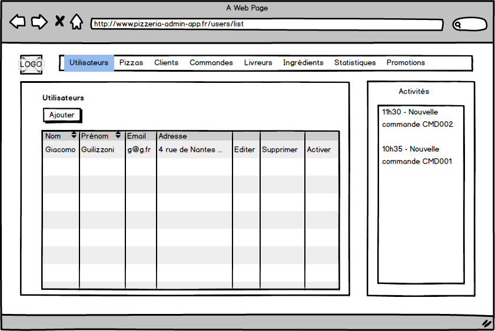
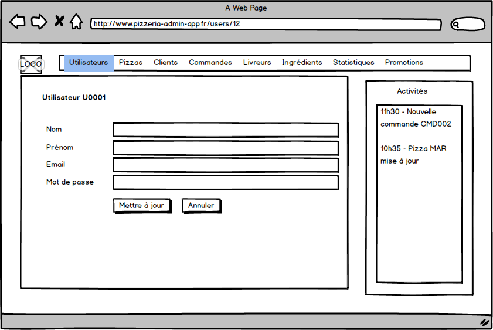

# USA003 - Utilisateur - CRUD 

En tant qu'administrateur, je souhaite pouvoir gérer les utilisateurs (opérations CRUD).
Les utilisateurs sont les professionnels de la pizzeria.

L'action "Supprimer" supprime définitivement l'utilisateur de la base de données.

Le bouton "Activer" alimente un flag pour rendre un utilisateur actif ou non.

Le mot de passe est sauvegardé de manière "hashée" (utiliser l'algorithme BCrypt).

